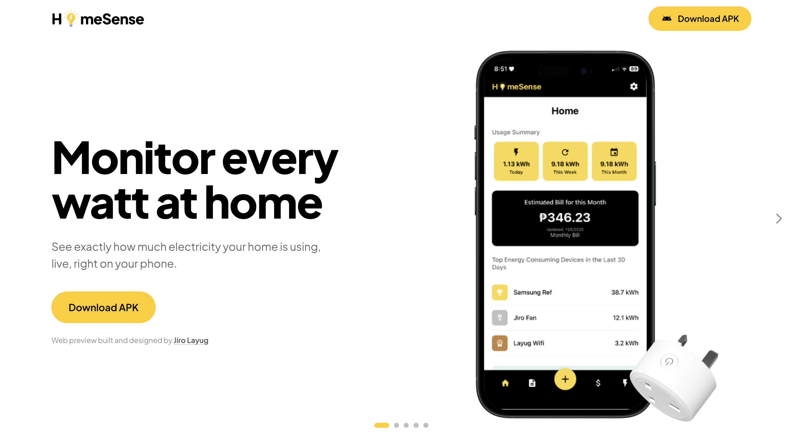
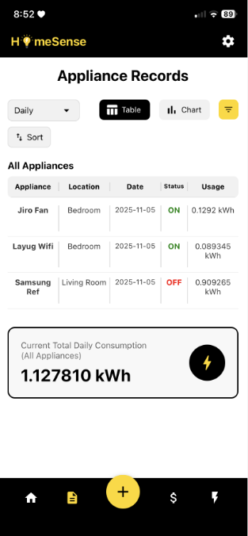
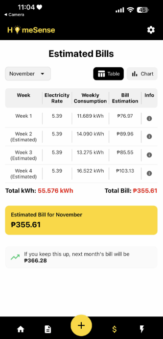
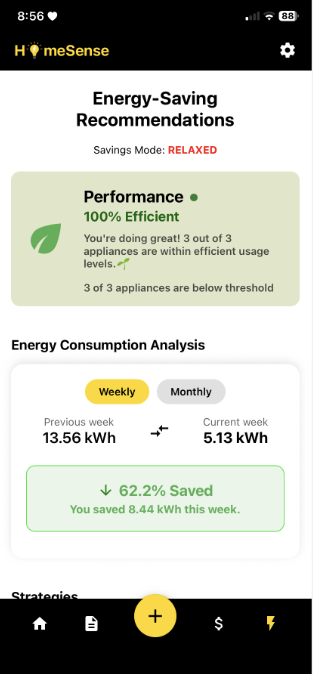
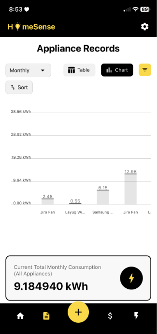
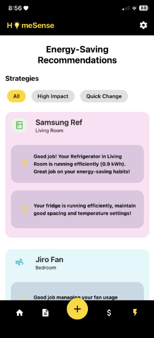
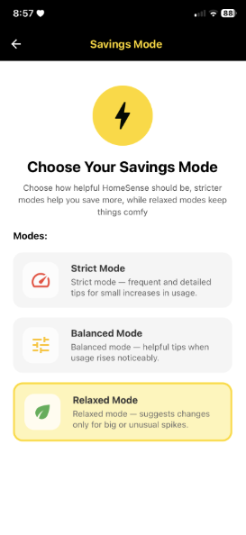

# HomeSense

[Live demo](https://homesense-web.vercel.app/)

This repository contains the **web showcase** only.This README is a project document for **HomeSense**, a household electricity-monitoring thesis project. It presents the product experience and mobile-app interface, while the mobile app, data collection, and backend services are separate parts of the full system.

## The problem

Household electricity use is usually visible only after a bill arrives. That makes it hard to identify which appliances are consuming power, notice unusual spikes, or make small changes that lower costs.

## What I built

I designed and built the web experience that presents the HomeSense product story and mobile-app interface. It demonstrates how a household can:

- View real-time appliance usage by room and on/off status
- Track total daily consumption in kWh
- See a projected monthly bill in Philippine pesos
- Review usage trends and estimated costs
- Receive alerts for unusual consumption and practical energy-saving recommendations

## How it works

`Smart plug → data storage → HomeSense mobile app → web showcase`

A smart plug is a small device placed between an appliance and its wall outlet; it measures the electricity that appliance uses. It captures appliance-level readings, which HomeSense organizes into a live feed, cost and usage summaries, bill predictions, alerts, and recommendations. This repository contains the standalone web showcase for the thesis concept.

<table align="center">
  <tr><th>Live usage</th><th>Bill prediction</th><th>Usage history</th></tr>
  <tr>
    <td align="center"></td>
    <td align="center"></td>
    <td align="center"></td>
  </tr>
  <tr><th>Device details</th><th>Recommendations</th><th>Alerts</th></tr>
  <tr>
    <td align="center"></td>
    <td align="center"></td>
    <td align="center"></td>
  </tr>
</table>

## Full project architecture

The full HomeSense system moves from appliance readings to a household-facing mobile experience. The layers below describe the project beyond this web showcase.

| Layer | Technology | Responsibility |
| --- | --- | --- |
| 1. Data collection | Python | A collector script gathers appliance-level electricity readings from the monitoring hardware and prepares them for the rest of the system. |
| 2. Data layer | MongoDB | Stores usage readings, device information, historical consumption, and the data needed for reporting and predictions. |
| 3. Application API | FastAPI | Provides the backend API that connects stored energy data with the client application and exposes it in a usable format. |
| 4. Bill prediction | Flask | Runs the bill-prediction service, turning consumption data into an estimated monthly electricity cost. |
| 5. Mobile experience | React Native | Delivers the household-facing app for checking usage, projected costs, alerts, and energy-saving recommendations. |

## Live demo

Visit [homesense-web.vercel.app](https://homesense-web.vercel.app/).
