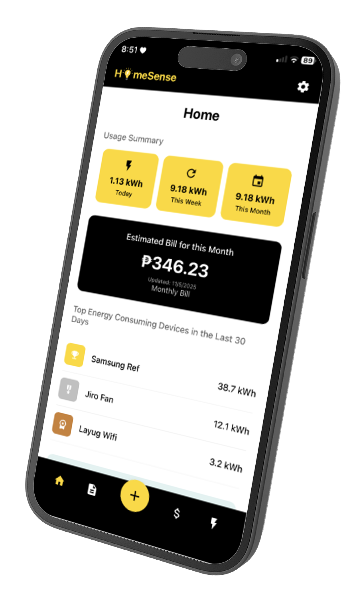

# HomeSense

[Live demo](https://homesense-web.vercel.app/)

A responsive web showcase for **HomeSense**, a household electricity-monitoring thesis project. It turns appliance-level energy data into an interface that helps households understand usage before the monthly bill arrives.


## The problem

Household electricity use is usually visible only after a bill arrives. That makes it hard to identify which appliances are consuming power, notice unusual spikes, or make small changes that lower costs.

## What I built

I designed and built the web experience that presents the HomeSense product story and mobile-app interface. It demonstrates how a household can:

- View real-time appliance usage by room and on/off status
- Track total daily consumption in kWh
- See a projected monthly bill in Philippine pesos
- Review usage trends and estimated costs
- Receive alerts for unusual consumption and practical energy-saving recommendations

## How it works

`Smart plug → data storage → HomeSense mobile app → web showcase`

A smart plug captures appliance-level readings. The HomeSense experience organizes those readings into a live feed, cost and usage summaries, bill predictions, alerts, and recommendations. This repository contains the standalone web showcase for the thesis concept.



## Tech

- React 19 + TypeScript
- Vite
- Tailwind CSS
- Framer Motion
- Lucide React

## Run locally

Requirements: Node.js 18+ and npm.

```bash
cd frontend
npm install
npm run dev
```

Open the local URL printed by Vite (normally `http://localhost:5173`).

### Useful commands

```bash
npm run build  # production build
npm run test   # component tests
npm run lint   # lint the frontend
```

## Live demo

Visit [homesense-web.vercel.app](https://homesense-web.vercel.app/).
